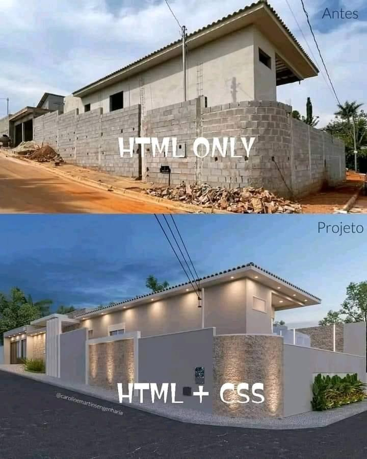
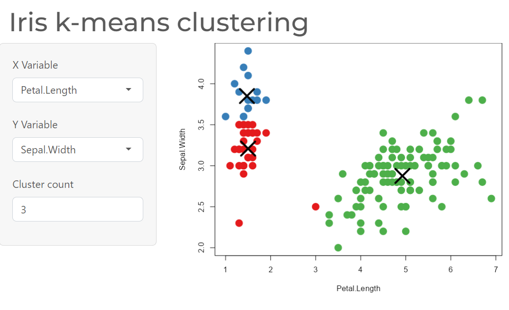
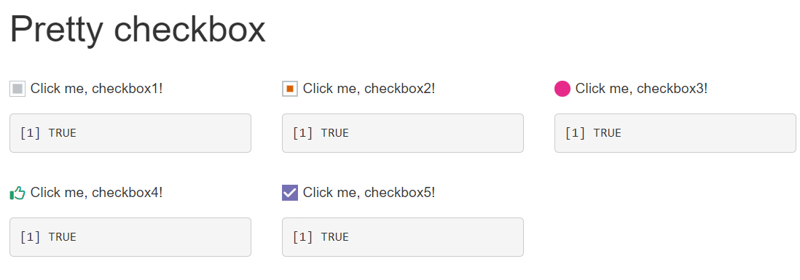
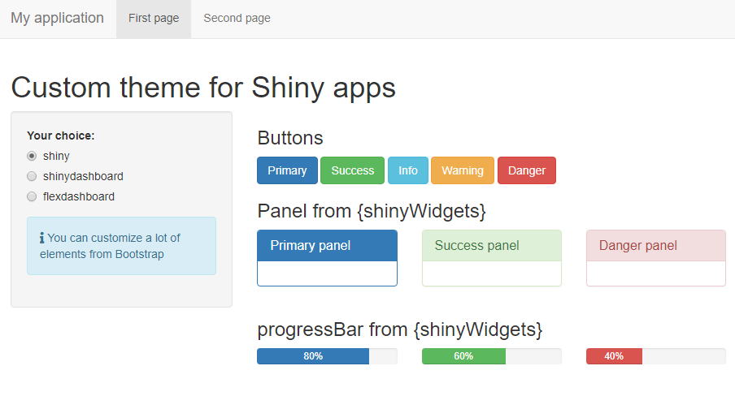
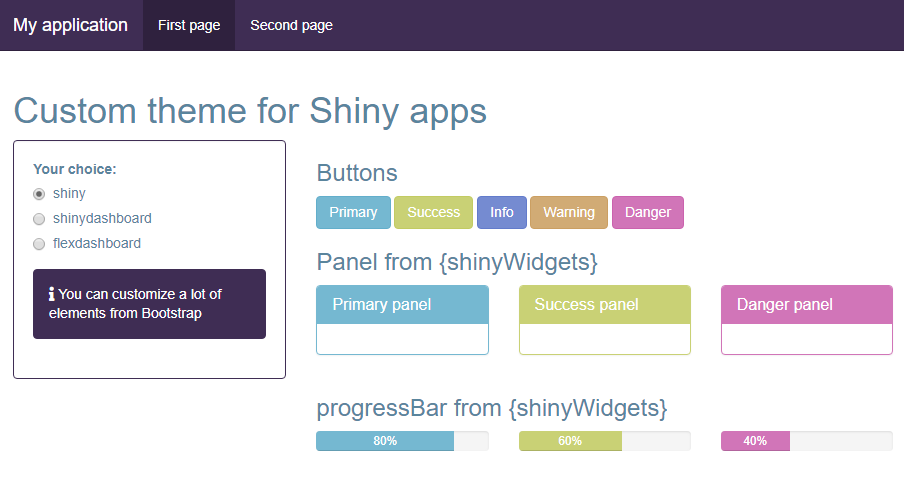

```{r setup, include = FALSE}
# Setup chunk
# Paquetes a usar
#options(htmltools.dir.version = FALSE) cambia la forma de incluir código, los colores

library(knitr)
library(tidyverse)
library(xaringanExtra)
library(icons)
library(fontawesome)
library(emo)

# set default options
opts_chunk$set(collapse = TRUE,
               dpi = 300,
               warning = FALSE,
               error = FALSE,
               comment = "#")

top_icon = function(x) {
  icons::icon_style(
    icons::fontawesome(x),
    position = "fixed", top = 10, right = 10
  )
}

knit_engines$set("yaml", "markdown")

# Con la tecla "O" permite ver todas las diapositivas
xaringanExtra::use_tile_view()
# Agrega el boton de copiar los códigos de los chunks
xaringanExtra::use_clipboard()

# Crea paneles impresionantes 
xaringanExtra::use_panelset()

# Para compartir e incrustar en otro sitio web
xaringanExtra::use_share_again()
xaringanExtra::style_share_again(
  share_buttons = c("twitter", "linkedin")
)

# Funcionalidades de los chunks, pone un triangulito junto a la línea que se señala
xaringanExtra::use_extra_styles(
  hover_code_line = TRUE,         #<<
  mute_unhighlighted_code = TRUE  #<<
)

# Agregar web cam

xaringanExtra::use_webcam()
```

```{r xaringan-editable, echo=FALSE}
# Para tener opciones para hacer editable algun chunk
xaringanExtra::use_editable(expires = 1)
# Para hacer que aparezca el lápiz y goma
xaringanExtra::use_scribble()
```

```{r xaringan-themer, include=FALSE, warning=FALSE}
# Establecer colores para el tema
library(xaringanthemer)
#style_mono_light(base_color = "#562457")
```

class: title-slide, middle, center
background-image: url(imagenes/liigh_unam_logo.png) 
background-position: 10% 10%
background-size: 15% 


.center-column[
# `r rmarkdown::metadata$title`
### `r rmarkdown::metadata$subtitle`

####`r rmarkdown::metadata$author` 
#### `r rmarkdown::metadata$date`
]

---

## Paquetes necesarios

```{r eval=FALSE}
install.packages("bslib")   # Crea tus propios temas
install.packages("bsicons") # Temas decorativos para shiny app
install.packages("fresh")   # Temas decorativos para shiny ap
install.packages("plotly")  # Graficas interactivas
install.packages("RColorBrewer") # paletas de colores
install.packages("paletteer")    # paletas de colores
install.packages("gapminder")    # base de datos gapminder
install.packages("pacman")  # Instalacion y cargar paquetes multiples
install.packages("shinythemes") # Temas determinados para shiny
install.packages("shinyWidgets") # shiny opciones
install.packages("DT")    # Tablas bonitas
#install.packages("gt")    # Tablas bonitas

# Emojis e iconos
install.packages("fontawesome")
devtools::install_github("hadley/emo")
remotes::install_github("mitchelloharawild/icons")
```

---
## Cargar paquetes

```{r eval=FALSE}
library(shiny)
library(bslib)        # Crea tus propios temas para shiny app, Manual https://github.com/rstudio/bslib/
library(fresh)        # Temas decorativos
library(ggplot2)      # visualizacion grafica
library(plotly)       # Graficas interactivas
library(dplyr)        # Manipulacion de datos
library(RColorBrewer) # paletas de colores 
library(paletteer)    # paletas de colores, manual https://github.com/EmilHvitfeldt/paletteer
library(gapminder)    # base de datos gapminder
library(shinythemes)  # Temas determinados para shiny, manual https://rstudio.github.io/shinythemes/
library(shinyWidgets) # shiny opciones
library(DT)           # Tablas bonitas
# library(gt)           # Tablas bonitas, manual https://gt.rstudio.com/

# Emojis e iconos
library(icons)       # manual https://github.com/mitchelloharawild/icons
library(fontawesome) # manual https://github.com/rstudio/fontawesome
library(emo)         # manual https://github.com/hadley/emo
# Pagina web de emoji Github, https://gist.github.com/rxaviers/7360908
```

---
background-image: url(imagenes/liigh_unam_logo.png) 
background-position: 10% 10%
background-size: 10%
class: middle, center


# Sobre mi
----

.left-col[

### `r fontawesome::fa("dna", fill = "#181818")` Dra. Evelia Lorena Coss-Navarrete

Investigadora Posdoctoral en el Laboratorio Internacional de Investigación sobre el Genoma Humano [(LIIGH), UNAM](https://twitter.com/LIIGH_UNAM), campus Juriquilla


[`r fontawesome::fa("link")` Dra Alejandra Medina-Rivera](https://liigh.unam.mx/profile/dra-alejandra-medina-rivera/)

[`r fontawesome::fa("github")` EveliaCoss.github.io](https://eveliacoss.github.io/)

]


.center-col[


### `r fontawesome::fa("star", fill = "#181818")` Miembro

- [LupusRGMX](https://twitter.com/LupusRgmx)

- [Proyecto JAGUAR](https://twitter.com/PJaguarLATAM)

- [Rladies Morelia](https://www.facebook.com/profile.php?id=100093337606435)

- [CDSB - Mexico](https://twitter.com/CDSBMexico)

- [RIABIO](https://twitter.com/RiaBioNet)
]


.right-col[

### `r fontawesome::fa("circle-nodes", fill = "#181818")` Formación académica

- Doctorado en Biotecnología de Plantas, [Cinvestav, Langebio](https://twitter.com/uga_langebio),  [`r fontawesome::fa("link")` Dra Selene Fernandez-Valverde](https://twitter.com/SelFdz)

- Maestría en Biotecnología de Plantas, [Cinvestav, Unidad Irapuato](https://twitter.com/CinvestavIra)

- Ing. en Biotecnología, [UPSIN](https://www.facebook.com/UPSINSINALOA)

]


---

class: center, middle

`r fontawesome::fa("laptop-file", height = "3em")`
# Buenas prácticas de programación

---

## Buenas prácticas de programación: Set up de tu trabajo

Es buena idea comenzar **todos** tus scripts con las mismas líneas de código que indiquen lo siguiente:

.content-box-gray[
- *Título de tu programa*
- *Autor (author)*: Su nombre
- *Fecha (date)*: Fecha de creación
- *Propósito general de tu programa (Description)*: ¿Para qué sirve el programa? Ej: El siguiente programa realiza la suma de dos numeros enteros a partir de la entrada del usuario y posteriormente la imprime en pantalla.
- *Usage* ¿Cómo se utiliza?
- *Paquetes (packages)*
- *Directorio de trabajo (Working directory)*: En que carpeta se encuentra tu datos y programa.
  - *Directorio de input*: aquí estan guardados los datos que vas a usar en el programa
  - *Directorio de output*: aquí es donde vas a guardar tus resultados
- *Argumentos (Arguments)*
  - *Información de entrada (Data Inputs)*: Ej: Solo numeros enteros (sin decimales).
  - *Información de salida (Outpus)*: Graficas, figuras, tablas, etc.
- Líneas en donde cargues los datos que vas a usar
]

---

.center[

]

---

class: center, middle

`r fontawesome::fa("laptop-file", height = "3em")`
# ¿Qué es el CSS?

---

## ¿Qué es el CSS?

CSS (cascading style sheets) permiten crear páginas web atractivas.

Serie de instrucciones sobre los colores y estructura que tendrá el HTML.

```{r eval=FALSE}
body {
  font-family: Arial, Helvetica, sans-serif;
}

h1 {
  color: #375e97;
  font-size: 2em;
  font-family: Georgia, 'Times New Roman', Times, serif;
  border-bottom: 1px solid #375e97;
}
```

Se pueden crear desde programas de texto plano o en R.

---

.center[

]

---

## CSS en R

Existen paquetes que te permiten 1) Crear, 2) usar y 3) almacenar CSS desde R.

Hoy usaremos los paquetes `bslib`, `fresh`, `shinyWidgets` y `shinythemes`.

---

## Paquete `bslib`

.center[

]

---

## Paquete `shinyWidgets`

.center[

]

---

## Paquete `fresh`

.center[

]

---

## Paquete `fresh`


.center[

]

---

class: center, middle

`r fontawesome::fa("code", height = "3em")`
# Sábado 11 de Noviembre 2023  
## Desarrollo de aplicaciones con Shiny App en R

Instructora: Jazmin Lopez

Github: [VieRnes de Bioinformática](https://github.com/EveliaCoss/ViernesBioinfo)

Gracias por tu atención, respira y coméntame tus dudas. 

